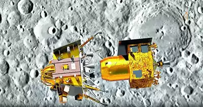

# EX01 Developing a Simple Webserver
## Date:

## AIM:
To develop a simple webserver to serve html pages.

## DESIGN STEPS:
### Step 1: 
HTML content creation.

### Step 2:
Design of webserver workflow.

### Step 3:
Implementation using Python code.

### Step 4:
Serving the HTML pages.

### Step 5:
Testing the webserver.

## PROGRAM:

    
    <!DOCTYPE html>
    <html lang="en">
    <head>
    <meta charset="UTF-8">
    <meta name="viewport" content="width=device-width, initial-scale=1.0">
    <title>ISRO</title>
    </head>
    <link href="https://cdn.jsdelivr.net/npm/bootstrap@5.3.3/dist/css/bootstrap.min.css" rel="stylesheet" integrity="sha384-QWTKZyjpPEjISv5WaRU9OFeRpok6YctnYmDr5pNlyT2bRjXh0JMhjY6hW+ALEwIH" crossorigin="anonymous">
    
    <body style="background-image: url('psuje1ek.png');background-size: cover;">
    

    

     
    

    

        <a href="">HOME</a>
        <a href="">OUR MISSIONS</a>
        <a href="">ARCHIVES</a>
        <a href="">GOALS</a>
        <a href="">IND2020</a>
        <a href="">CONTACT</a>
    

    

        
    

     

     <h1 style="color: red; font-size: 50px ;">ISRO,Indian Space Research Organisation</h1>
     <h1 style="color: orange; font-size: 20px ;">ISRO, the Indian Space Research Organisation,     pioneers space exploration and satellite technology, 
    propelling India's advancements in space science and satellite communication,    making strides towards 
    unlocking the mysteries of the cosmos and enhancing global connectivity.</h1>
    

      

    
    

      <h5 class="card-title">CHANDRAYAN 3</h5>
      
ISRO successfully returns the Chandrayaan-3 Propulsion Module (PM) 
        to Earth's orbit after surpassing lunar mission objectives.
         The mission aimed to showcase a soft landing near the lunar 
         south polar region using the Vikram Lander and Pragyaan

       

      <a href="http://timesofindia.indiatimes.com/articleshow/105735162.cms?utm_source=contentofinterest&utm_medium=text&utm_campaign=cppst" class="btn btn-primary">READ MORE</a>
    

      

     

    
    

      <h5 class="card-title">PM Modi reveals names of 4 astronauts for Gaganyaan mission      </h5>
      
Prime Minister Narendra Modi on Tuesday announced the names of the four astronauts
         that will fly to low-Earth orbit as part of the Indian Space Research Organisation’s
         (ISRO) Gaganyaan, which will be the first crewed Indian space mission.

      <a href="https://indianexpress.com/article/technology/science/four-gaganyaan-astronauts-announced-9183379/" class="btn btn-primary">READ MORE</a>
    

      
  
    

    
    

      <h5 class="card-title">Aditya L1 </h5>
      
Aditya L1 Mission Highlights: The Indian Space Research Organisation (ISRO)'s 
        ambitious debut mission to study the Sun, Aditya L1, will reach its final destination on Saturday at 4pm. 
        ISRO will perform the final manoeuvre on Saturday to inject Aditya-L1 spacecraft 
        -- the first space-based Indian observatory to study the Sun.

      <a href="https://www.livemint.com/science/news/aditya-l1-isros-first-sun-mission-live-space-based-indian-observatory-to-enter-final-halo-orbit-11704532260232.html" class="btn btn-primary">READ MORE</a>
    

      

    
    

     
     

        

          <button type="button" data-bs-target="#carouselExampleIndicators" data-bs-slide-to="0" class="active" aria-current="true" aria-label="Slide 1"></button>
          <button type="button" data-bs-target="#carouselExampleIndicators" data-bs-slide-to="1" aria-label="Slide 2"></button>
          <button type="button" data-bs-target="#carouselExampleIndicators" data-bs-slide-to="2" aria-label="Slide 3"></button>
        

        

          

            
          

          

            
          

          

            
          

        

        <button class="carousel-control-prev" type="button" data-bs-target="#carouselExampleIndicators" data-bs-slide="prev">
          
          Previous
        </button>
        <button class="carousel-control-next" type="button" data-bs-target="#carouselExampleIndicators" data-bs-slide="next">
          
          Next
        </button>
      

      
    </body>
    </html>

## OUTPUT:

## RESULT:
The program for implementing simple webserver is executed successfully.
